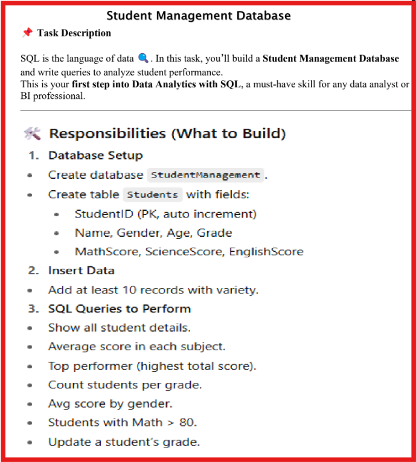

# 🎓 Maincraft Data Analysis (SQL) - Internship



## 📋 Project Overview

This internship project focuses on **SQL database design, data manipulation, and advanced query analysis** using a comprehensive **Student Management System**. The project demonstrates practical SQL skills including database creation, table design, data insertion, and complex analytical queries on real-world student performance data.

---

## 📁 Source Code

### 🔧 Main Query File: `Query console.sql`

This is the **core file** containing all database operations and SQL queries for the Student Management System. The file is organised into three main sections:

#### **Section 1️⃣ - Database Setup**
- ✅ Creates the `StudentManagement` database
- ✅ Defines the `students` table with the following schema:
    - `student_id` (SMALLINT UNSIGNED) - Unique student identifier (Primary key)
    - `name` (VARCHAR(50)) - Student's full name
    - `gender` (CHAR(1)) - Gender indicator (M/F)
    - `age` (SMALLINT UNSIGNED) - Student's age
    - `grade` (VARCHAR(2)) - Academic grade (A, B, C, D, A+)
    - `math_score` (SMALLINT UNSIGNED) - Mathematics score
    - `science_score` (SMALLINT UNSIGNED) - Science score
    - `english_score` (SMALLINT UNSIGNED) - English score
- ✅ Applies column name normalization (CamelCase → snake_case) using ALTER TABLE statements

#### **Section 2️⃣ - Data Population**
- ✅ Inserts 10 student records with diverse grades, ages, and performance metrics
- ✅ Sample students include: Shree, Shubham, Snehal, Pooja, Akansha, Ruturaj, Rutuja, Amrut, Kalyani, Niraj
- ✅ Each record contains complete academic performance data across all three subjects

#### **Section 3️⃣ - Advanced SQL Queries**

The query console includes **7 comprehensive analytical queries**:

| Query # | Purpose | Technique Used |
|---------|---------|-----------------|
| 3.1 | Display all student details | Basic SELECT |
| 3.2 | Calculate average scores by subject | Aggregate Functions (AVG) |
| 3.3 | Identify top performer | CTE + Window Functions |
| 3.4 | Count students per grade | GROUP BY + COUNT |
| 3.5 | Gender-wise performance analysis | CTE + COALESCE + ROUND |
| 3.6 | Filter students with high math scores | WHERE clause filtering |
| 3.7 | Update student grade | UPDATE statement |

---

## 📊 Program Flow & Execution

### **Step-by-Step Workflow:**

```
┌─────────────────────────┐
│   Database Creation      │ ← Creates StudentManagement DB
└────────────┬────────────┘
             │
┌────────────▼────────────┐
│   Table Definition      │ ← Defines students table schema
└────────────┬────────────┘
             │
┌────────────▼────────────┐
│   Column Normalization  │ ← ALTER TABLE rename operations
└────────────┬────────────┘
             │
┌────────────▼────────────┐
│   Data Insertion        │ ← INSERT 10 student records
└────────────┬────────────┘
             │
┌────────────▼────────────┐
│   Query Execution       │ ← Run 7 analytical queries
└─────────────────────────┘
```

---

## 🖼️ Output Screenshots

### **Screenshot 1️⃣ - Query 3.1: All Student Details**


**Purpose:** Retrieves complete information for all 10 students enrolled in the system.

**SQL Query:**
```sql
SELECT * FROM StudentManagement.students;
```

**Output Details:**
- ✅ Shows all 10 student records with complete columns
- ✅ Displays: student_id, name, gender, age, grade, math_score, science_score, english_score
- ✅ Students range from grade A to D with ages 26-29

---

### **Screenshot 2️⃣ - Query 3.2: Average Scores by Subject**


**Purpose:** Calculates the average score across all students for each subject (Math, Science, English).

**SQL Query:**
```sql
SELECT AVG(math_score)    AS avg_maths_score,
       AVG(science_score) AS avg_science_score,
       AVG(english_score) AS avg_english_score
FROM students;
```

**Output Details:**
- ✅ Average Math Score: **82.8000**
- ✅ Average Science Score: **80.1000**
- ✅ Average English Score: **81.4000**
- ✅ Demonstrates aggregate function usage for data insights

---

### **Screenshot 3️⃣ - Query 3.3: Top Performer (Highest Total Score)**


**Purpose:** Identifies the student with the highest combined score across all three subjects using Common Table Expression (CTE).

**SQL Query:**
```sql
WITH cte_total_score AS (SELECT student_id,
                                COALESCE(math_score, 0) +
                                COALESCE(science_score, 0) +
                                COALESCE(english_score, 0) AS row_total
                         FROM students)
SELECT student_id, MAX(row_total) AS max_row_total
FROM cte_total_score
GROUP BY student_id
ORDER BY max_row_total DESC
LIMIT 1;
```

**Output Details:**
- ✅ **Student ID:** 10
- ✅ **Total Score:** 298 (Highest performer!)
- ✅ Demonstrates advanced CTE usage and COALESCE for NULL handling

---

### **Screenshot 4️⃣ - Query 3.4: Count Students per Grade**


**Purpose:** Provides grade distribution of students across all categories.

**SQL Query:**
```sql
SELECT grade AS Grade, COUNT(grade) AS Grade_Count
FROM students
GROUP BY grade;
```

**Output Details:**
- ✅ **Grade A:** 3 students
- ✅ **Grade B:** 4 students
- ✅ **Grade C:** 2 students
- ✅ **Grade D:** 1 student
- ✅ Shows distribution across different academic performance levels

---

### **Screenshot 5️⃣ - Query 3.5: Average Score by Gender (Male vs Female)**


**Purpose:** Compares average total performance between male and female students.

**SQL Query:**
```sql
WITH cte_total_score AS (SELECT gender,
                                COALESCE(math_score, 0) +
                                COALESCE(science_score, 0) +
                                COALESCE(english_score, 0) AS row_total
                         FROM students)
SELECT gender, ROUND(AVG(row_total), 2) AS avg_total_score
FROM cte_total_score
GROUP BY gender;
```

**Output Details:**
- ✅ **Male Students (M):** Average Total Score = **251.40**
- ✅ **Female Students (F):** Average Total Score = **237.20**
- ✅ Male students show slightly higher average performance
- ✅ Uses ROUND function for data precision

---

### **Screenshot 6️⃣ - Query 3.6: Students with Math Score > 80**


**Purpose:** Filters and displays students who scored above 80 in Mathematics.

**SQL Query:**
```sql
SELECT student_id, math_score, name
FROM students
WHERE math_score > 80;
```

**Output Details:**
- ✅ Displays high-performing math students
- ✅ Includes: student_id, math_score, and name
- ✅ Demonstrates WHERE clause filtering for conditional data retrieval

---

### **Screenshot 7️⃣ - Query 3.7: Database Explorer View**


**Purpose:** Updated the database table column(Grade) where student_id = 10 from grade A to 'A+'

**Details:**
- ✅ Database: `@SQL-Internship`
- ✅ Schema: `studentmanagement`
- ✅ Table: `students`
- ✅ Columns: 1 field (grade)
- ✅ Shows keys and indexes for database optimisation

---

## 📈 Key Features & Highlights

✨ **Database Design:**
- Normalized table structure with proper data types
- AUTO_INCREMENT primary key for data integrity
- Constraint-based design ensuring data quality

🔍 **SQL Techniques Demonstrated:**
- ✅ CREATE and ALTER operations
- ✅ INSERT statements with data validation
- ✅ SELECT queries with multiple clauses
- ✅ Aggregate functions (AVG, COUNT, MAX)
- ✅ Common Table Expressions (CTE) for complex logic
- ✅ GROUP BY and WHERE filtering
- ✅ COALESCE for NULL handling
- ✅ ROUND for numerical precision

📊 **Data Insights:**
- 10 diverse student records
- Performance analysis across three subjects
- Grade distribution and gender-wise comparison
- Top performer identification
- High-performance filtering

---

## 🎯 Use Cases & Applications

This project can be extended for:
- 📌 Student performance tracking system
- 📌 Academic analytics dashboard
- 📌 Grade distribution reports
- 📌 Subject-wise performance benchmarking
- 📌 Gender-based equity analysis in education
- 📌 Automated student ranking systems

---

## 📝 Most Useful Commits

### **Commit 1:** `47d259d`
```
This file contains database & table creation, insert & alter statements and multiple working queries on the created StudentManagement database.
```
- **Impact:** Core functionality - contains all database setup and queries
- **Changes:** Complete Query console.sql with 7 analytical queries
---

## 🚀 Getting Started

1. **Open the SQL console/IDE** (DBeaver, MySQL Workbench, or any SQL client)
2. **Execute the `Query console.sql` file** step by step
3. **Follow the three main sections:**
    - Database and table creation
    - Data insertion
    - Query execution
4. **Analyze the output** using the screenshots as reference

---

## 💡 Key Learnings

This project reinforces:
- Database design principles and normalization
- SQL query optimization techniques
- Data aggregation and analysis
- Real-world data manipulation scenarios
- Professional SQL documentation practices

---

## 📚 Project Structure

```
📦 Maincraft-Data-Analysis-Internship
├── 📄 Query console.sql      ← Main SQL script (124 lines)
├── 📄 README.md              ← Project documentation (this file)
└── 📁 .git                   ← Version control history
```

---

**Project Type:** 🏫 Educational | Data Analysis | SQL Development  
**Status:** ✅ Complete  
**Last Updated:** 2026  
**Internship Program:** Maincraft Data Analysis with SQL  

